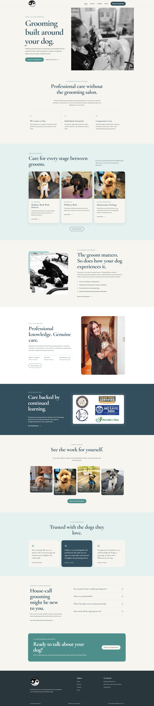

# Trainquil Effects

A responsive business website designed and developed for **Trainquil Effects**, a house-call dog grooming and behavior consulting business serving the greater Idaho Falls area.

**Live Website:** https://trainquileffects.com

## About the Project

Trainquil Effects needed a modern website that better reflected the personal, professional, and cooperative approach of the business.

The site was designed to clearly explain how house-call grooming differs from traditional salon and mobile grooming while giving potential clients an easy way to explore services, learn about professional qualifications, view previous grooming work, and request an appointment.

The finished website combines a warm, trustworthy visual identity with responsive front-end development and interactive JavaScript features.

## Features

- Fully responsive design for desktop, tablet, and mobile
- Custom multi-page website design
- House-call grooming service information
- Dynamic grooming portfolio
- Professional certification and continuing education showcase
- Appointment request form with email delivery
- Custom appointment email subjects
- FAQ accordion
- Responsive mobile navigation
- Client testimonials
- Local storage for selected service preferences
- Custom domain with HTTPS
- Accessibility-conscious semantic HTML
- Optimized WebP imagery
- Native lazy loading for below-the-fold images

## Pages

### Home

Introduces the Trainquil Effects brand, house-call grooming model, client experience, services, and featured grooming work.

### Services

Explains the house-call grooming process and presents the available grooming services, personalized pricing approach, cooperative care philosophy, and scheduling recommendations.

### Portfolio

Showcases real Trainquil Effects grooming clients through a dynamically generated gallery.

### About

Introduces the groomer, professional philosophy, qualifications, certifications, continuing education, and appointment request form.

## Technologies

- HTML5
- CSS3
- JavaScript
- Responsive Web Design
- CSS Grid
- Flexbox
- DOM Manipulation
- JavaScript Arrays and Objects
- Local Storage
- FormSubmit
- Git
- GitHub
- GitHub Pages

## Design

The visual system was created around a calm and professional palette of blue-gray, muted teal, soft aqua, warm ivory, and charcoal.

Typography combines **Cormorant Garamond** for expressive headings with **Nunito Sans** for clean and approachable body copy.

The overall design emphasizes whitespace, authentic photography, clear visual hierarchy, and an approachable premium feel appropriate for a personalized in-home grooming service.

## Development Highlights

The grooming portfolio and continuing education sections are generated from JavaScript data rather than being individually hard-coded into the HTML.

JavaScript also powers the responsive navigation, FAQ interactions, appointment form enhancements, dynamic footer information, and local storage functionality.

The appointment system uses FormSubmit to deliver requests directly to the business while dynamically generating descriptive email subjects using the client's and dog's names.

## Deployment

The production website is deployed through GitHub Pages and connected to the business's custom domain.

**Production:** https://trainquileffects.com

HTTPS is enforced for secure connections.

## Project Status

The website is live and actively used by Trainquil Effects.

Future updates can include additional portfolio clients, service information, certifications, and other business content as needed.

---

Designed and developed by **Hollow Grove Studio**  
*Where good ideas take root.*